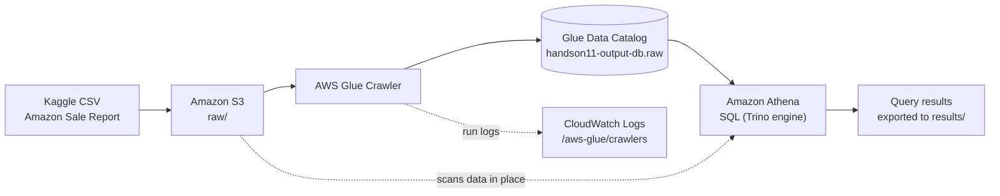

## AWS S3 → Glue crawler → Athena window-function analytics on ~129k Kaggle e-commerce sales

A serverless analytics workflow on AWS for the Kaggle E-Commerce Sales Dataset (`Amazon Sale Report.csv`, approximately 129k order-line records). The raw CSV lives in Amazon S3. An AWS Glue crawler infers its schema into the Glue Data Catalog, and Amazon Athena queries the file in place using schema-on-read, with no load step or database to manage. Amazon CloudWatch captures the crawler's run logs.

The analysis consists of five Athena SQL queries covering running totals, geographic loss hotspots, promotion impact, per-category product ranking, and month-over-month growth. They use CTEs, window functions (`SUM() OVER`, `RANK()`, `LAG()`), and defensive parsing to handle inconsistent source data.

---

## Architecture



| Layer | Service | Responsibility |
|---|---|---|
| Storage | Amazon S3 | Holds the raw source CSV (`raw/`); `processed/` is reserved for curated output |
| Catalog | AWS Glue Crawler + Data Catalog | Infers the schema and registers the `raw` table |
| Query | Amazon Athena | Serverless SQL directly over S3 |
| Observability | Amazon CloudWatch Logs | Crawler run logs under `/aws-glue/crawlers` |
| Access control | AWS IAM | Service role that the Glue crawler assumes |

### Design highlights

- **Schema-on-read.** The CSV is never loaded into a database. Glue infers the table definition, and Athena applies it at query time.
- **Defensive parsing.** `try_cast` turns malformed numeric values into `NULL` instead of failing the query. Dates are normalized by trying several `date_parse` formats in turn inside `COALESCE(try(...))`.
- **Window-function analytics.** Running totals with `SUM() OVER`, top-N per group with `RANK() OVER (PARTITION BY ...)`, and period-over-period growth with `LAG()`.
- **CTE-structured queries.** Each query separates parsing, aggregation, and presentation into named CTEs, which keeps the logic readable and easy to test step by step.
- **Pay-per-query cost model.** No compute is provisioned. Athena bills by the amount of data each query scans.

---

## Dataset

**Source:** Kaggle, E-Commerce Sales Dataset (`Amazon Sale Report.csv`), about 129k order-line records. Each row is one line item, so a single order can span several rows.

Columns used in the analysis:

| Column | Used for |
|---|---|
| `Date` | Order date; parsed from several formats |
| `Status` | Order status: fulfilment, cancellation, and return states |
| `Category` | Product category |
| `SKU` | Product variant identifier |
| `Qty` | Units ordered |
| `Amount` | Line revenue |
| `promotion-ids` | Promotions applied; empty when none |
| `ship-state` | Shipping destination state |

Types are enforced at query time with `try_cast` rather than relying on the types the crawler infers. The dataset has no cost or margin fields, so every analysis measures **revenue**, not profit.

---

## Repository Structure

```
aws-ecommerce-athena/
├── README.md
├── queries/
│   └── queries.sql                       # The five Athena queries
├── results/
│   ├── q1_cumulative_sales.csv
│   ├── q2_unprofitable_hotspots.csv
│   ├── q3_discount_vs_profitability.csv
│   ├── q4_top3_by_category.csv
│   └── q5_monthly_growth.csv
└── screenshots/
    ├── s3_bucket.png
    ├── iam_role.png
    ├── crawler.png
    └── cloudwatch_crawler2.png
```

## Resource Reference

| Resource | Value |
|---|---|
| S3 bucket | `handson-l11-cloud-computing` |
| Raw data | `s3://handson-l11-cloud-computing/raw/Amazon Sale Report.csv` |
| Processed zone | `s3://handson-l11-cloud-computing/processed/` (reserved) |
| IAM role | `HandsOnRole` |
| Glue database | `handson11-output-db` |
| Glue table | `raw` |
| Crawler log group | `/aws-glue/crawlers` |

---

## Prerequisites

- An AWS account with permission to create S3, IAM, Glue, and Athena resources
- AWS CLI v2 configured with your target region
- The Kaggle dataset downloaded locally

---

## Setup

### 1. Configure Amazon S3

```bash
aws s3 mb s3://handson-l11-cloud-computing
aws s3 cp "Amazon Sale Report.csv" "s3://handson-l11-cloud-computing/raw/Amazon Sale Report.csv"
```


*S3 bucket showing the `raw/` and `processed/` prefixes.*

### 2. Create the IAM service role

| Setting | Value |
|---|---|
| Role name | `HandsOnRole` |
| Trusted entity | `glue.amazonaws.com` |
| Managed policies | `AWSGlueServiceRole`, `AmazonS3FullAccess`, `CloudWatchFullAccess` |

The Glue crawler assumes this role. Athena queries run under the IAM identity of whoever executes them (for example, your console user), not under this role.


*`HandsOnRole` and its attached policies.*

### 3. Create and run the Glue crawler

| Setting | Value |
|---|---|
| Data source | `s3://handson-l11-cloud-computing/raw/` |
| IAM role | `HandsOnRole` |
| Target database | `handson11-output-db` |

The crawler names the table after the crawled prefix, which produces the table `raw`.

```bash
aws glue get-tables --database-name handson11-output-db --query "TableList[].Name"
```


*Glue crawler after a successful run.*

### 4. Verify the crawler run in CloudWatch

Open the `/aws-glue/crawlers` log group and confirm that the latest run finished successfully and created the table.

```bash
aws logs tail /aws-glue/crawlers --since 1h
```


*CloudWatch log events for the crawler run.*

### 5. Configure Athena

- **Data source:** `AwsDataCatalog`
- **Database:** `handson11-output-db`
- **Query result location:** set one in the workgroup settings (a dedicated prefix such as `s3://<bucket>/athena-results/` works well)

The database name contains hyphens, so it must be double-quoted in SQL. Athena runs one statement per execution, so each query below fully qualifies the table as `"handson11-output-db"."raw"` instead of relying on a separate `USE` statement.

---

## Analytical Queries

All five queries are also in `queries/queries.sql`. Their exported outputs are in `results/`.

### Q1: Cumulative Daily Sales (2022)

The query first aggregates revenue to one row per day, then computes a running total over the days. Aggregating first matters: many line items share the same date, and a running sum over tied rows comes back in arbitrary order.

```sql
WITH base AS (
  SELECT
    CAST(COALESCE(
      try(date_parse("Date", '%m/%d/%Y')),
      try(date_parse("Date", '%m-%d-%y')),
      try(date_parse("Date", '%m/%d/%y'))
    ) AS date)                      AS order_date,
    try_cast("Amount" AS double)    AS amount
  FROM "handson11-output-db"."raw"
),
daily AS (
  SELECT order_date, SUM(amount) AS daily_sales
  FROM base
  WHERE order_date IS NOT NULL
    AND year(order_date) = 2022
  GROUP BY order_date
)
SELECT
  order_date,
  ROUND(daily_sales, 2) AS daily_sales,
  ROUND(SUM(daily_sales) OVER (
    ORDER BY order_date
    ROWS BETWEEN UNBOUNDED PRECEDING AND CURRENT ROW
  ), 2)                             AS cumulative_sales
FROM daily
ORDER BY order_date;
```

**Results**

<!-- TODO: paste the output of the corrected Q1 here (first and last several rows, or the full table). -->

### Q2: Geographic Hotspots for Lost Revenue

Revenue on cancelled, returned, and rejected line items, grouped by shipping state. State names are trimmed and uppercased so spelling variants group together.

```sql
SELECT
  UPPER(TRIM("ship-state"))                     AS state,
  COUNT(*)                                      AS affected_lines,
  ROUND(SUM(try_cast("Amount" AS double)), 2)   AS lost_revenue
FROM "handson11-output-db"."raw"
WHERE "ship-state" IS NOT NULL
  AND (
        lower("Status") = 'cancelled'
     OR lower("Status") LIKE '%return%'
     OR lower("Status") LIKE '%reject%'
  )
GROUP BY 1
ORDER BY lost_revenue DESC
LIMIT 10;
```

**Results**

<!-- TODO: paste the output of the corrected Q2 here. -->

### Q3: Promotion Impact on Revenue per Unit by Category

Compares line items with and without a promotion applied, within each category. Average revenue per unit serves as a proxy for price realization.

```sql
SELECT
  "Category"                                                       AS category,
  CASE WHEN NULLIF(TRIM("promotion-ids"), '') IS NOT NULL
       THEN 'Promo' ELSE 'No Promo' END                            AS promotion,
  ROUND(SUM(try_cast("Amount" AS double)), 2)                      AS total_sales,
  SUM(try_cast("Qty" AS integer))                                  AS total_units,
  ROUND(SUM(try_cast("Amount" AS double))
        / NULLIF(SUM(try_cast("Qty" AS integer)), 0), 2)           AS avg_revenue_per_unit
FROM "handson11-output-db"."raw"
GROUP BY 1, 2
ORDER BY category, promotion
LIMIT 10;
```

**Results (first 10 rows)**

| category | promotion | total_sales | total_units | avg_revenue_per_unit |
|---|---|---:|---:|---:|
| Blouse | No Promo | 189,719.18 | 357 | 531.43 |
| Blouse | Promo | 268,689.00 | 506 | 531.01 |
| Bottom | No Promo | 42,746.98 | 102 | 419.09 |
| Bottom | Promo | 107,921.00 | 296 | 364.60 |
| Dupatta | Promo | 915.00 | 3 | 305.00 |
| Ethnic Dress | No Promo | 299,233.66 | 396 | 755.64 |
| Ethnic Dress | Promo | 491,984.00 | 657 | 748.83 |
| Saree | No Promo | 30,401.76 | 32 | 950.06 |
| Saree | Promo | 93,532.00 | 120 | 779.43 |
| Set | No Promo | 11,161,675.90 | 12,020 | 928.59 |

In every category shown, promoted line items realize equal or lower revenue per unit. The gap is widest for Saree (950.06 vs. 779.43) and Bottom (419.09 vs. 364.60). Blouse and Ethnic Dress show almost no difference.

### Q4: Top 3 SKUs by Revenue Within Each Category

```sql
WITH product_totals AS (
  SELECT
    "Category"                              AS category,
    "SKU"                                   AS sku,
    SUM(try_cast("Amount" AS double))       AS total_sales
  FROM "handson11-output-db"."raw"
  GROUP BY 1, 2
),
ranked AS (
  SELECT
    category,
    sku,
    total_sales,
    RANK() OVER (PARTITION BY category ORDER BY total_sales DESC) AS sales_rank
  FROM product_totals
)
SELECT category, sku, ROUND(total_sales, 2) AS total_sales, sales_rank
FROM ranked
WHERE sales_rank <= 3
ORDER BY category, sales_rank, sku
LIMIT 10;
```

**Results (first 10 rows)**

| category | sku | total_sales | sales_rank |
|---|---|---:|---:|
| Blouse | J0217-BL-M | 24,288.90 | 1 |
| Blouse | J0217-BL-L | 20,908.33 | 2 |
| Blouse | J0217-BL-S | 20,670.99 | 3 |
| Bottom | BTM038-PP-S | 2,989.90 | 1 |
| Bottom | BTM039-PP-XXXL | 2,862.86 | 2 |
| Bottom | BTM039-PP-M | 2,828.58 | 3 |
| Dupatta | DPT032 | 305.00 | 1 |
| Dupatta | DPT052 | 305.00 | 1 |
| Dupatta | DPT041 | 305.00 | 1 |
| Ethnic Dress | J0006-SET-M | 73,072.95 | 1 |

`RANK()` gives tied values the same rank, so a category can return more than three SKUs. Dupatta shows three SKUs tied at rank 1. Use `ROW_NUMBER()` instead if you need exactly three rows per category.

### Q5: Month-over-Month Sales Growth

```sql
WITH base AS (
  SELECT
    date_trunc('month', CAST(COALESCE(
      try(date_parse("Date", '%m/%d/%Y')),
      try(date_parse("Date", '%m-%d-%y')),
      try(date_parse("Date", '%m/%d/%y'))
    ) AS date))                     AS month,
    try_cast("Amount" AS double)    AS amount
  FROM "handson11-output-db"."raw"
),
monthly AS (
  SELECT month, SUM(amount) AS total_sales
  FROM base
  WHERE month IS NOT NULL
  GROUP BY 1
)
SELECT
  month,
  ROUND(total_sales, 2) AS total_sales,
  ROUND(100.0 * (total_sales - LAG(total_sales) OVER (ORDER BY month))
        / NULLIF(LAG(total_sales) OVER (ORDER BY month), 0), 2) AS sales_growth_mom_pct
FROM monthly
ORDER BY month;
```

**Results**

| month | total_sales | sales_growth_mom_pct |
|---|---:|---:|
| 2022-03-01 | 101,683.85 | n/a |
| 2022-04-01 | 28,838,708.32 | 28,261.15 |
| 2022-05-01 | 26,226,476.75 | -9.06 |
| 2022-06-01 | 23,425,809.38 | -10.68 |

The dataset's March data covers only March 31, so April's growth figure compares a full month with a single day and should not be read as real growth. The meaningful trend runs from April to June: revenue fell about 9% in May and about 11% in June.

---

## Analytical Caveats

- **Revenue, not profit.** The dataset has no cost data, so the "profitability" framing in the original assignment prompts is measured here as revenue.
- **Truncated outputs.** Q2, Q3, and Q4 use `LIMIT 10`. Remove the limit to see all states, categories, and SKUs.
- **Partial months.** March 2022 contains a single day, which distorts any growth metric based on it.
- **Missing amounts.** Some cancelled line items have no `Amount`. `SUM` ignores those `NULL`s, so Q2 understates the true value of cancellations.

## Troubleshooting

| Symptom | Likely cause | Resolution |
|---|---|---|
| Crawler creates no table | Role lacks S3 read access, or the path is wrong | Check `HandsOnRole` and the crawler's `raw/` source path |
| `SCHEMA_NOT_FOUND` or syntax error on the database name | Hyphenated identifier used without quotes | Quote it: `"handson11-output-db"` |
| `COLUMN_NOT_FOUND` for `ship-state` or `promotion-ids` | Hyphenated column names used without quotes | Wrap them in double quotes |
| Error about running more than one statement | `USE` and `SELECT` executed together | Run one statement at a time, or fully qualify table names |
| Dates come back `NULL` | The source format isn't among the parsed patterns | Add the pattern to the `COALESCE(try(date_parse(...)))` chain |
| No output location specified | The workgroup has no query result location | Set one in Athena workgroup settings |

## Security and Production Considerations

- **Least privilege.** Replace `AmazonS3FullAccess` with a policy that grants read access only to this bucket's `raw/` prefix. `AWSGlueServiceRole` already allows writing to `/aws-glue/*` log groups, so `CloudWatchFullAccess` can usually be removed.
- **Account identifiers.** Keep AWS account IDs and full role ARNs out of public repositories.
- **Athena guardrails.** Use a dedicated workgroup with encrypted query results and a per-query data-scanned limit.
- **Columnar storage.** Use `processed/` for a Parquet copy of the data, created with an Athena CTAS statement or a Glue job and partitioned by month. This cuts both scan cost and query latency.

## Cleanup

To avoid ongoing charges, delete the Glue crawler and the `handson11-output-db` database, empty and delete the S3 bucket (including the Athena results prefix), and remove `HandsOnRole`.
